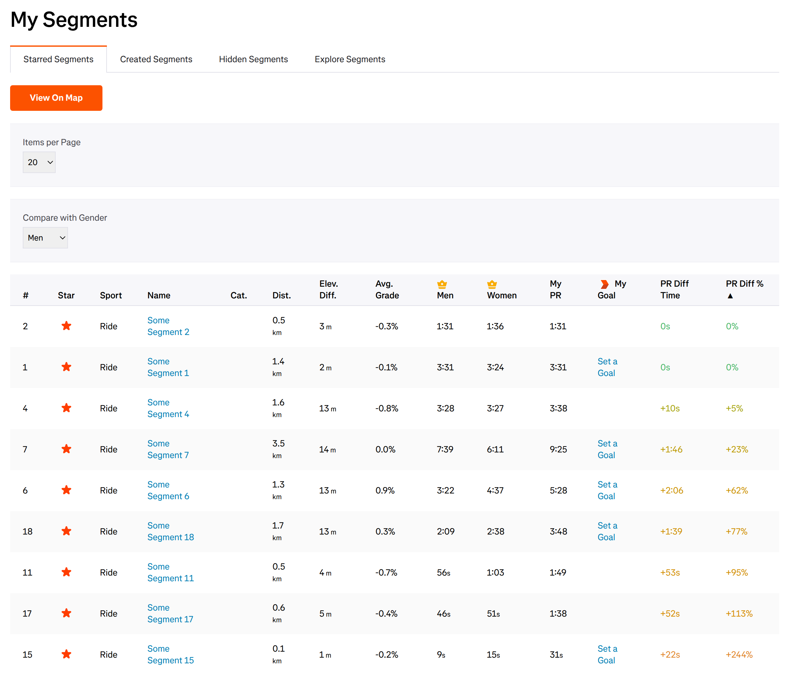

<!-- Project Header -->

  

  <h1 class="projectName">Better Segments for Strava</h1>

  

    
    
    
    
  

  

    A userscript for Strava that adds additional stats and features to the starred segments page.
  

   

## About
Hunting for [Strava] crowns? This script may help. It runs in your browser and adds additional stats and features to the [starred segments page] on Strava to help you find segments that you already hold a competitive time on.

### Features
- **➕ Additional columns**:
  - **Absolute difference**: View the difference between your time and the segment record in seconds
  - **Relative difference**: View the difference between your time and the segment record as a percentage
- **↕️ Sortable columns**: Sort the table by any column in ascending or descending order
- **🎨 Color-coded values**: Differences between your time and the segment record are color-coded to help you quickly identify segments where you hold a competitive time
- **📄 Configurable # of items per page**: Increase the number of segments shown per page from the default 20 all the way up to 2000
- **🚻 Configurable gender for comparison**: Compare your PR against the segment record for men, women, or the fastest time overall

### Screenshots
|  |
| ---------------------------------------------------------------------------------- |
| _Starred segments page ([strava.com/athlete/segments/starred]) - v0.1.1_           |

## Installation
> [!CAUTION]
> For security reasons, I do not recommend running scripts from the internet unless you understand what they are doing. If you are not a developer, I recommend reading the comments in the code and/or asking a LLM like [ChatGPT] or [Claude] to explain it to you.

I recommend using this script with a userscript manager because it will keep the script up-to-date and run it automatically when you visit the appropriate page. If you don't want to do that, you can also run it manually.

### Using a userscript manager
A userscript manager is a browser extension that allows you to organize and run scripts on websites. If you don't already have one, I would recommend [Violentmonkey], [Tampermonkey], or [Greasemonkey]. Once installed, you can click the button below to install the script.

### Manually
> [!NOTE]
> This only works once. If the page gets reloaded (ex. by changing the # of items per page) or you navigate away and come back, you will have to run the script again. If you want to run the script automatically, I suggest using a userscript manager.

Alternatively, you can run the script by going to [strava.com/athlete/segments/starred], copying the code in [better-segments-for-strava.user.js], and pasting it into your browser's devtools console.

  
<b>Detailed instructions:</b>

  <ol>
    <li>Open <a href="https://www.strava.com/athlete/segments/starred">strava.com/athlete/segments/starred</a> in your browser</li>
    <li>Open your browser's devtools console (<a href="https://balsamiq.com/support/faqs/browserconsole/">how?</a>)</li>
    <li>Copy the code in <a href="better-segments-for-strava.user.js">better-segments-for-strava.user.js</a> and paste it into the console. If this doesn't work or you see a warning message about pasting, see the <a href="#FAQ">FAQ</a>.</li>
    <li>Press enter to run the script. You should see the page update. If this doesn't happen, see the <a href="#FAQ">FAQ</a>.</li>
  </ol>

## Usage
This script only works on the starred segments page, so you will need to star segments that you want to track.

### Setting the number of items per page
By default, Strava only shows 20 segments per page. You can use the `Items per Page` dropdown to change this to 50, 100, or 200. This will reload the page.

### Setting gender for comparison
The script doesn't know your gender, so it defaults to using the fastest time overall to calculate differences. You can use the `Compare with Gender` dropdown to change the gender used for comparison.

### Sorting
> [!NOTE]
> Sorting only applies to the current page of results. If you want to sort the entire list, you will need to increase the number of items per page so that all segments are shown on a single page.

Click on the column headers to sort the table. Clicking on the same column header again will reverse the sort order.

### Color coding
Differences between your time and the record time are color coded, with warmer colors indicating a slower time and cooler colors indicating a faster time:
|                    🟣🔵 |      🟢      | 🟡🟠🔴                 |
| --------------------: | :---------: | ------------------- |
| <0% (ahead of leader) | 0% (leader) | >0% (behind leader) |

## FAQ

### Nothing shows up when I paste in the console / I get a warning when I try to paste in the console
Some browsers prevent you from pasting code in the console because it could be malicious. This is called Paste Protection and you can read more about it on the [Chrome for Developers Blog].

If this happens, follow the instructions in the console to re-enable pasting, and then try again. For Chrome, the following steps should work:
 1. Try to paste something in the console. You should get a warning message about pasting
 2. Type "allow pasting" in the console and press enter

 See [this video] for a visual walkthrough.

### I get an `Uncaught SyntaxError: Unexpected identifier` error when running the script
Make sure that you select the entire file with <kbd>Ctrl</kbd> + <kbd>A</kbd> when copying it. If part of the script is cut off, it won't work.

## Contributing
If you encounter any problems with the script, feel free to [create an issue].

Pull requests, bug reports, translations, and other kinds of contributions are greatly appreciated. By contributing code, you agree to license your contributions under the terms of the [LICENSE].

## License
This project is licensed under the MIT License. See [LICENSE](LICENSE) for details.

The project logo is based on [vip-crown-line] by [Remix Icon],
licensed under [Apache License 2.0]. I have added start and end points to the line below the crown.

This project is not affiliated with or endorsed by Strava in any way.

## 💕 Funding

Find this project useful? [Sponsoring me](https://johng.io/funding) will help me cover costs and **_commit_** more time to open-source.

If you can't donate but still want to contribute, don't worry. There are many other ways to help out, like:

- 📢 reporting (submitting feature requests & bug reports)
- 👨‍💻 coding (implementing features & fixing bugs)
- 📝 writing (documenting & translating)
- 💬 spreading the word
- ⭐ starring the project

I appreciate the support!

[Apache License 2.0]: https://github.com/Remix-Design/remixicon/blob/master/License
[better-segments-for-strava.user.js]: better-segments-for-strava.user.js
[ChatGPT]: https://chatgpt.com/
[Chrome for Developers Blog]: https://developer.chrome.com/blog/self-xss
[Claude]: https://claude.ai
[create an issue]: https://github.com/jerboa88/better-segments-for-strava/issues
[Greasemonkey]: https://github.com/greasemonkey/greasemonkey
[LICENSE]: LICENSE
[Remix Icon]: https://remixicon.com/]
[starred segments page]: https://www.strava.com/athlete/segments/starred
[strava.com/athlete/segments/starred]: https://www.strava.com/athlete/segments/starred
[Strava]: https://strava.com
[Tampermonkey]: https://www.tampermonkey.net/index.php
[this video]: https://youtu.be/X5uyCtVD1-o?si=AOrzgez90KiDlA-z&t=11
[Violentmonkey]: https://violentmonkey.github.io/
[vip-crown-line]: https://remixicon.com/icon/vip-crown-line
